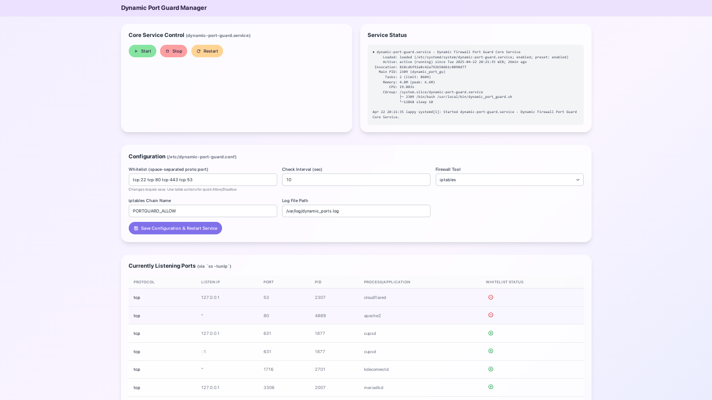
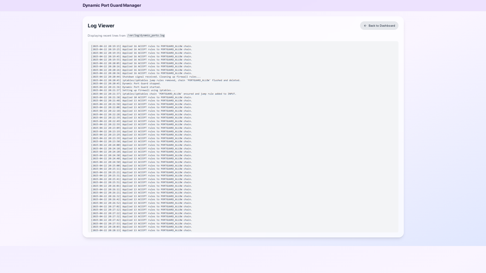
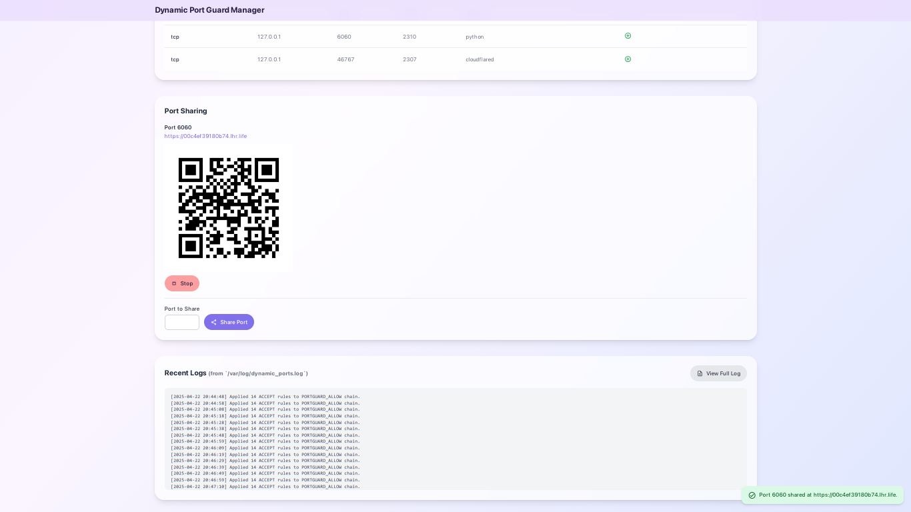

[](https://opensource.org/licenses/MIT)

# Dynamic Port Guard

**⚠️ WARNING:** This tool modifies your firewall rules and requires a default‑deny policy. Misconfiguration can lock you out of your server—always backup your iptables configuration, whitelist critical ports (e.g., SSH port 22), and ensure alternative access (console or out‑of‑band) before enabling.

A lightweight, dynamic firewall manager that “opens ports when needed, closes them when not.” It consists of:

1. **Core Service (`dynamic-port-guard`)**  
   A bash daemon that monitors listening ports and updates an `iptables`‑based allow chain automatically.

2. **Web UI (`dynamic-port-webui`)**  
   An optional Flask interface (running in its own Python 3 venv) for status, configuration, logs, and—new—port‑sharing via SSH reverse tunnels.

---

## Screenshots





## Table of Contents

- [How It Works](#how-it-works)  
- [Key Features](#key-features)  
- [Prerequisites](#prerequisites)  
- [Installation](#installation)  
- [Usage](#usage)  
  - [Core Service Control](#core-service-control)  
  - [Web UI](#web-ui)  
  - [Port Sharing](#port-sharing)  
  - [`portguard` Alias](#portguard-alias)  
- [Configuration](#configuration)  
- [Security Considerations](#security-considerations)  
- [Troubleshooting](#troubleshooting)  
- [Contributing](#contributing)  
- [License](#license)

---

## How It Works

1. **Monitor**  
   Every 10 s (default), the core script runs `ss` to list TCP/UDP ports in `LISTEN` on IPv4/IPv6.

2. **Whitelist**  
   Merges live ports with user‑specified `WHITELIST` in `/etc/dynamic-port-guard.conf`.

3. **iptables Chain**  
   - Creates/jumps to a dedicated chain (default: `PORTGUARD_ALLOW`).  
   - Flushes its rules each cycle.  
   - Adds `ACCEPT` for each allowed port/protocol.

4. **Default-Deny**  
   Assumes your main `INPUT` policy is `DROP` or has rules *after* the jump to block everything else.

---

## Key Features

- Dynamic Port Allowing  
- Whitelist Support for critical services  
- IPv4 & IPv6  
- Dedicated `iptables` chain for easy management  
- Systemd integration for both core & Web UI  
- Isolated Python venv for Web UI  
- Minimal resource usage  
- **Port Sharing**: Expose any local port securely via an SSH reverse tunnel (default: `localhost.run`). The Web UI automatically captures the generated `.lhr.life` URL, updates it live through a background monitor thread, and displays a QR code for easy mobile access. **⚠️ WARNING:** Exposing services publicly can pose security risks—only share ports you trust.

---

## Prerequisites

- **OS:** Linux with `systemd` (tested on Debian/Ubuntu).  
- **Firewall tools:** `iptables`, `ip6tables`.  
- **Core tools:** `bash`, `ss` (from `iproute2`), `awk`, `grep`, `sort`.  
- **SSH:** Client must be installed; port‑sharing uses `localhost.run`.  
- **Python 3:** `python3`, `python3-pip`, `python3-venv` (or `python3-virtualenv`).  
- **Root access:** Required to manage firewall and systemd.

---

## Installation

```bash
git clone https://github.com/1999AZZAR/dynamic_port_guard.git
cd dynamic-port-guard
sudo ./install.sh            # Core + Web UI (default)
# or:
sudo ./install.sh --core-only
sudo ./install.sh --webui-only
```

This will:

- Install `dynamic_port_guard.sh` to `/usr/local/bin/`  
- Create `/etc/dynamic-port-guard.conf` (from example)  
- Enable & start `dynamic-port-guard.service`  
- (Web UI) Copy `webui/→/opt/dynamic-port-webui`, create venv, install Flask  
- Enable & start `dynamic-port-webui.service`  
- Add `portguard` alias to your `~/.bashrc`

---

## Usage

### Core Service Control

```bash
sudo systemctl status  dynamic-port-guard.service
sudo systemctl start   dynamic-port-guard.service
sudo systemctl stop    dynamic-port-guard.service
sudo systemctl restart dynamic-port-guard.service
sudo journalctl -u dynamic-port-guard.service -f
```

### Web UI

Visit <http://localhost:6060> (or `http://<your-server-ip>:6060`). You can:

- View listening ports & statuses  
- Edit & save `/etc/dynamic-port-guard.conf`  
- Tail the log (`/var/log/dynamic_ports.log`)  
- Control core service via buttons  
- Share local ports (see below)

### Port Sharing

In the Web UI’s “Ports” list, click **Share** on any port:

1. Creates an SSH reverse tunnel to `localhost.run`.  
2. Captures & displays the `.lhr.life` URL.  
3. Generates a QR code for easy mobile access.  
4. Runs a background monitor thread to detect URL changes and update live.  
5. Click **Stop** to terminate the tunnel.

### `portguard` Alias

After installing Web UI, run:

```bash
source ~/.bashrc
portguard
```

This shows core + UI status and attempts to open the Web UI in your browser.

---

## Configuration

All settings live in `/etc/dynamic-port-guard.conf`. Example options:

```ini
# Poll interval in seconds
INTERVAL=10
# Always allow these ports
WHITELIST="22 80 443"
# Firewall chain name
IPTABLES_CHAIN="PORTGUARD_ALLOW"
# Log file
LOG_FILE="/var/log/dynamic_ports.log"
```

Edit & save via Web UI or your editor, then restart:

```bash
sudo systemctl restart dynamic-port-guard.service
```

---

## Security Considerations

> **⚠️ CRITICAL WARNING:** This tool directly manipulates `iptables` rules. A misconfiguration may lock you out of your server. Always ensure SSH (or your remote access port) is whitelisted and you have alternative access methods.

- **Default‑deny** policy is required; this tool only *adds* allow rules.  
- Services run as `root`; consider a hardened sudo setup for least privilege.  
- Web UI listens on port 6060—limit exposure via firewall or host binding.  
- Only whitelist truly necessary ports.  
- No egress filtering—this is inbound only.

---

## Troubleshooting

- **Core fails**:  
  ```bash
  sudo journalctl -u dynamic-port-guard.service -n 50 --no-pager
  tail -n 50 /var/log/dynamic_ports.log
  ```

- **Web UI fails**:  
  ```bash
  sudo journalctl -u dynamic-port-webui.service -n 50 --no-pager
  /opt/dynamic-port-webui/venv/bin/pip list | grep Flask
  ```

- **Cannot access UI**:  
  ```bash
  sudo ss -tlpn 'sport == :6060'
  iptables -nvL INPUT --line-numbers
  iptables -nvL PORTGUARD_ALLOW | grep 6060
  ```

---

## Contributing

Contributions welcome! Please fork, create a branch, and open a PR.  
Ensure you test on a systemd‑based distro and update docs accordingly.

---

## License

MIT 2025 1999AZZAR
